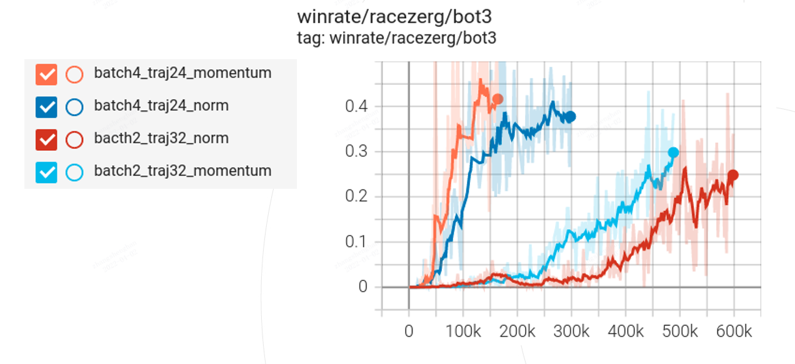
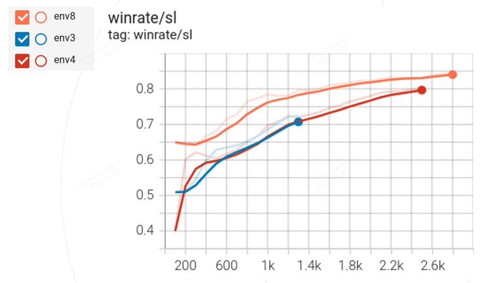

# Introduction
   StarCraft II is a one of the most challenging environments in reinforcement learning.
AlphaStar gives us a solution using a complicated training procedure and massive computing resources,
 which is unavailable for most individuals. We provide a baseline using very limited resource
 (one pc with 32G RAM、 8G GPU). If you want to train your own agent or conduct further research based on this code base,
 this guidance will help you walk through the whole training pipeline.

# Outline

In recent years, with the help of deep learning, artificial intelligence is developing rapidly. For example, in 2016,
AI conquered Go, which had previously been regarded as the "last bastion" of intellectual games. Since then, researchers
 start making AI challenge eSports, which is more complicated than board game and may not have optimal solution.

AlphaStar and OpenAI Five, are the most famous and success results in these fields. AlphaStar, focus on one-vs-one real-time
 strategy game -- StarCraft II, while OpenAI Five focus on five-vs-five Multiplayer online battle arena game -- Dota II.
 Both of them reach the top level of human professional players. Followings are the main features of these two
 approaches.

AlphaStar fist use human replays to train a supervised model, then use reinforcement learning to improve this model.
In the second stage, developers don't use a lot of reward functions, and these parameters are easy to adjust.

On the other hand, OpenAI five don't need human data, it trains from scratch, i.e. start reinforcement learning directly.
 Developers of OpenAI Five make great use of prior game knowledge, and design a sophisticated reward function to guide AI learning
  how to kill enemies and how to cooperate with each other.

In this guidance, we follow the approach of AlphaStar. To make sure everyone is able to have a try, we focus on single
race -- Zerg, first train a supervised model using limited replays,  and then improve it on single map with the help of
self play.


## Supervised Training
### 1. Download replays

To start supervised training, first we need to build our training dataset, i.e. download human replays.

Blizzard has already porvided a lot of game replays of different races and different maps,
all of which are available at [blizzard replays download page](https://github.com/Blizzard/s2client-proto/tree/master/samples/replay-api) .
However, in our small-scale supervised training, we don't need so many replays. Only 9000 zerg-vs-zerg replays
(276MB) are required, which can be downloaded through [google drive](https://drive.google.com/file/d/15wOu3w8Gza3lG9-U9bbSH76sENfPuP9p/view?usp=sharing).

#### Replay versions
Each replay has a certain version, we need to download the corresponding StarCraft II client first.

On Linux, versions from 3.16 - 4.10 are supported, download [here](https://github.com/Blizzard/s2client-proto#linux-packages)

Different versions are stored at different StarCraft II path, so we use multiple environment variables to identify them like this:
```
export SC2PATH4_8_3=</your/4.8.3/path/of/StarCraft II>
export SC2PATH4_8_4=</your/4.8.4/path/of/StarCraft II>
```

On Windows, version 4.10.0 and newer are supported. Older ones have an issue with war fog.
Double click replays [here](../data/replays), The corresponding version of SC2 will be automatically downloaded.
As for maps, you can download the ladder maps within SC2 client by searching the map name when creating custom game.
You can find the ladder map list [here](https://liquipedia.net/starcraft2/Maps/Ladder_Maps/Legacy_of_the_Void)


### 2. Configuration
We use several *.yaml* files to configure training:

Model at [distar/agent/default/model/actor_critic_default_config.yaml](../distar/agent/default/model/actor_critic_default_config.yaml)

Learner at [distar/ctools/woker/learner/base_learner_default_config.yaml](../distar/ctools/worker/learner/base_learner_default_config.yaml)

Entry at [distar/bin/sl_user_config.yaml](../distar/bin/sl_user_config.yaml)

[sl_user_config.yaml](../distar/bin/sl_user_config.yaml) is the entry of SL training and the only file you need to change through training. It will overwrite 
other configurations if you put the same field there. We annotate each line in it for a better understanding.

Followings are some very important parameters needs further explanation in our small-scale training baseline.
- experiment_name:
Name of experiment, all the log, checkpoints and everything else will be saved under <working_directory/experiments/experiment_name>, default to be sl_train.
- trajectory_length:
We use LSTM in our model, it requires a sequence of observation&action pairs for training, larger trajectory will ensure better performance, default to be 32; 
- batch_size
Number of trajectories, trajectory_length * batch_size is the frames in each model update, default to be 2;
- num_workers:
Training data are derived from replays, the decoding process is slow, so we use multiple workers to speed it up. Each worker will start a SC2 client to decode replays one by one, so the num_workers should be larger than batch_size.
In remote mode, decoding replay happens in replay_actor, workers are used for receiving and caching data from replay_actor, default to be 4.
- replay_actor_num_workers(only used in remote mode):
Each worker in replay_actor will start a SC2 client to decode replays one by one and send it to learner through socket.
- load_path:
When we want to continue a previous supervised training, just set the load path to be the latest checkpoint path, default to be '', which is disabled. 

Our baseline can be trained with very limited resources, 32GB ram and 3070 gpu 8GB. If more resources are given, larger batch_size
&trajectory length are recommended such as (batch_size=4, trajectory length=24), as they will greatly increase model performance.

### 3. Training
Now we can start to train our supervised model:
```
python -m distar.bin.sl_train --data <abs/path/of/replay/paths>
```

After executing this command, a directory is generated named after the experiment name in config.
Within this directory, the following files/directories are generated:
- checkpoint: contain all checkpoints
- sl_user_config.yaml: backup of training config
- default_tb_logger: directory of tensorboard files, which records loss/accuracy/lr
- default_logger.txt: record of learner log

#### Remote mode
We build a communication system called Adapter. It's designed for large scale distributed computation. It used a centralized coordinator exchanging metadata and 
a underneath peer-to-peer socket exchanging data. Run remote mode like this:
```
python -m distar.bin.sl_train --type coordinator
python -m distar.bin.sl_train --type learner --remote
python -m distar.bin.sl_train --type replay_actor --data <path>
```
In remote mode, specify coordinator_ip and coordinator_port in [sl_user_config.yaml](../distar/bin/sl_user_config.yaml), then you can run learner and replay_actor on different machines. 
default is localhost:23333

### 4. Evaluation
In traditional supervised learning such as CV and NLP, loss and accuracy are two convenient and useful metrics
to measure model performance. However, in our case, models with lower loss and higher accuracy may not behave very well
when playing against with others. To overcome this problem and get a more accurate evaluation of training model, we use
StarCraft II built-in bot.

Blizzard, developer of StarCraft II, provides 10 different levels of built-in bots. The higher the level, the stronger
the bot is. These bots can play different kinds of strategies, thus are good opponents to measure model performance.
In our small-scale training, due to limited resources, we use level-3 bot to check our model performance.

After supervised training, we can run the following code to test the model performance against level-3 bot.
```
python -m distar.bin.play --game_type agent_vs_bot --model1 <abs/path/of/checkpoint/paths> --model2 bot3
```

#### Generate statistics Z(strategies) file:
AlphaStar used different building orders and built units derived from human replays to make agent play certain strategy during evaluation, We have multiple Z files(*.json)
prepared under [distar/agent/default/lib](../distar/agent/default/lib). They are only for zerg vs zerg on 7 maps (KairosJunction, CyberForest, Acropolis, KingsCove, NewRepugnancy,Automaton,PortAleksander), if you want to create your own files for new maps or races, run:

`python -m distar.bin.gen_z --data <replay path or file with replay path in each line> --name <output file name> --num_workers <number of workers>`

Output file will be saved at [distar/agent/default/lib](../distar/agent/default/lib)

Note: Only the winning side in replays will be decoded.
### Experiment Results
Followings are some experiment results of supervised training:

The above experiment use different batch size, trajectory_length and different way to clip grad. From the 
graph, we can find that larger batch size * traj-length will greatly improve training efficiency. So
if users have more resources, we strongly recommend increasing batch_size and trajectory_length

### Difference with AlphaStar
#### Insight
Supervised learning is relatively stable and fast compared to reinforcement learning. We modified the feature and structure of neural
network depends on the winrate against built-in bot from supervised training. Besides, zerg is the weakest race following the same training
paradigm according to AlphaStar and zerg-vs-zerg leads to early games full of simple rush-style strategies. We also made some modifications to tackle
those two problems.
#### Difference
- We keep the size of spatial features same as map size(AlphaStar scale them all to 128*128) for a more precise location choice when the agent constructs a building.
- Add effects like crossive bile and lurker attack spines to spatial features.
- Remove current_health, current_shields, current_energy, is_on_screen, ideal_harvesters from entity features.
- Use mineral content ratio and vespene content ratio instead of current_minerals/mined_minerals and current_vespene/mined_vespene from entity features.
- Add two boolean vectors(unit_type_bool, enemy_unit_type_bool) to scalar features, these indicate if this type of unit is ever made.
- Add one boolean vector(unit_order_type) to scalar features, this indicates if any unit is issuing this ability, this significantly reduce the number of repetitive buildings.
- Combine built units and upgrades together as cumulative statistics instead of use them separately.
- Discard effects in cumulative statistics, we think upgrades and units are enough to encode a strategy, effects should be more responsive.
- Remove hand-made available actions in scalar features and selected unit types in selected units head, also remove 
corresponding structure in neural network. This has no influence on performance and saves hand-made labor.
- Keep only 8 actions which make zergling in building orders, Zerg players
usually build lots of zerglings in Zerg vs Zerg, This gives more space for useful information in building orders.
- Ignore 7 responsive actions ('Build_SpineCrawler_pt', 'Build_SporeCrawler_pt', 'Build_PhotonCannon_pt', 'Build_ShieldBattery_pt',
    'Build_Bunker_pt', 'Morph_Overseer_quick', 'Build_MissileTurret_pt') in cumulative statistics. This helps defense.
- Ignore Build_SpineCrawler_pt in building order except spines around opponent's base. This helps defense and keeps the worker rush strategy.
- Record the game loop in every strategy derived from human replays, set Z to 0 when game exceeds the game loop in evaluation. This helps agent to transition when early rush failed.
- AlphaStar has a max selected units number (64), which is not enough for Zerg, Zerg can make more than one hundred units in one game.
At last selection in selected units head, we pick all units whose probability is larger than end flag. This maintains the same training procedure but with more selections.
- High-rank Zerg players often use special keyboards which speed up units making when pressing the button, This causes a lot of invaid actions when decoding replays. Filtering all of these actions may decrease performance, so we only enable it when generating statistics Z.

### Tips in Supervised training
- Learning rate warm-up
In a small-scale setting like our baseline, model may stuck in a local minimum at early stage in training. Adding a warm-up phase for learning rate will solve this problem.

- Temperature
According to AlphaStar, they used temperature 0.8 in evaluation. In our test, this only works after fine-tuning. Otherwise, temperature 1.0 is better.

### Large scale training
We use 56 Nvidia A100 graphics cards for learner and 1792 cpu cores for replay_actor in supervised training. 

The total batch size is 336, trajectory length is 64.

160k human replays(mmr above 4000, versions from 4.8.2 to 4.9.3) are used for training. 7k replays (mmr above 5800) are used for fine-tuning

After 165k iterations (1s per iteration, totally 2 days) of training, the agent has a 87% win rate against built-in elite bot. 
After 37k iterations of fine-tuning, the win rate reaches 97%. All evluation come from 100 games with setting Z to 0.

## Reinforcement Learning

Once we have a supervised model, we can start reinforcement learning. The followings are some important concepts and
 components in our setting:

1. Players
Players will play StarCraft II against each other. During League Training, we have two main types of players: active players and historical players.
The formers are players that we will use learner to update; while the latter will not be updated anymore, usually coming from old checkpoints of 
active players or game scripts(i.e. built-in bot).
2. League:
League is the entry and the center of in reinforcement training. First, it is a place to store status of different players (such as checkpoint path, payoff, fake reward statistic e.t.c).
Besides, League will also collect game results from actor and use them to update player status. Finally, based on these statuses, league will distribute jobs to actors and determine if a learner need to reset or not. 
League will start a http server and wait for requests from actor or learner. this should be the first script to run.
3. learner:
Similar to supervised training, learner is the place to update model, it request the initial model from league and send the number of frames they have been trained to league. Everytime they send the request of frames to league, they will receive a reset flag, if any learner is trained enough, the flag will become True and the learner will reset. This should be the third script
to run.
4. actor:
Actor is the place where players play against each other, it requests a job from league in every a few games, which contains model checkpoint path, map name and details of this matchup. It also send trajectories to learner and the game result to league. This should be the fourth script to run.
5. coordinator:
Communication between actors and learners are very frequent, and files being passed is very large. As a result, if we simply save to and load from disk, it will take a lot of time and greatly
reduce training efficiency. To overcome these problems, we use coordinator to transfer metadata and establish socket communication directly between actors and learner. This should be the second
scirpt to run.

### Configuration
Followings are some important parameters in [distar/bin/rl_user_config.yaml](../distar/bin/rl_user_config.yaml).
- common.experiment_name:
Name of experiment, default to be rl_train.
- league.resume_path:
When we want to resume a previous experiment, just put the path of previous league resume file (under `exp_name/league_resume`), to `config.league.resume_path`.
- league.active_players:
There are sevaral fields in form of list under `league.active_players`. The length of the list indicates how many active players you want to use. You can specify 
different parameters for each player like player id or checkpoint path. If you want to train 2 active players (let's make them MP0 and MP1) at the same time,
you need to run 2 learners:
```
python -m distar.bin.rl_train --type learner --player_id MP0
python -m distar.bin.rl_train --type learner --player_id MP1
```
- league.historical_players:
Similar to league.active_players, you can start the league with some fixed players like different models from supervised learning.

- actor.env_num:
We use multiprocessing and run multiple environments to speed up training, larger number is better, it depends on the your computer performance.

- actor.gpu_batch_inference: 
We use cpu for model inference as default, it's more flexible and no gpu required. You can also use gpu to perform inference by setting this to True.
In our test, given 16 environments, cpu costs 0.25s, gpu costs 0.16s per inference. The reason why gpu is not much faster is mainly because gpu have to wait and batch data together.

### Training
Running the following scripts in different terminal window.
```
python -m distar.bin.rl_train --type league --task selfplay
python -m distar.bin.rl_train --type coordinator
python -m distar.bin.rl_train --type learner
python -m distar.bin.rl_train --type actor
```
After executing this command, a directory is generated named after the experiment name in config.
Within this directory, the following files/directories are generated:
- actor_log: store logs of actors
- league_models: store backups of league models
- league_resume: resume files of league, used when we want to continue training
- config: store backups of config
- log: store logs of league
- tb_log: store tensorboard log if league
- default_tb_logger: directory of tensorboard files, which records loss/accuracy/lr
- default_logger.txt: record of learner log
- MP0/default_logger.txt:  logs of learner correspondent to MP0
- MP0/default_tb_logger:  tensorboard_logs of learner correspondent to MP0
- tmp/successive_model: store backup of successive models if we use trick dapo
### Experiment Results
Followings are some experiment results of supervised training:

These experiment have the same batch_size 4, trajectory_length 16 but different number of environment
in actor. 

### Difference with AlphaStar
1. AlphaStar uses opponent's observation to reduce variance in value estimation, this costs double data transmission and more GPU mermory,
instead we pull out some critical information from opponent's observation, so we can set our batch size to 6 instead of 4 in each graphics card.
2. AlphaStar uses 4 active players in league training, they are Main Player, League Exploiters * 2, Main Exploiter. We change one League Exploiter to 
Expert Exploiter which only uses a group of hand-picked strategies at one time(like mutalisk, hydralisk, you can find these *.json files here [agent/default/lib](../distar/agent/default/lib)).
3. We reset League Exploiter and Main Exploiter to a history checkpoint of Main Player instead of supervised model at late stage, cause
training from supervised model is too slow and nearly impossible to catch up the current league at that phase, this insight comes from [TStarBotX](https://arxiv.org/abs/2011.13729)

### Tips in Reinforcement training

- Value Pretrain:
When we start reinforcement learning, we'd better first fix policy model and only train the parts unique to the value network.
Otherwise, policy may be updated in the wrong direction due to the inaccuracy of value network.

- Maps:
More maps means more complexity, we cut down the number of maps from 7 to 3 at half stage of the training.


### Large scale training
We use 128 Nvidia A100 for 4 learners (each with 32) and approximately 10000 cpu cores for 300 actors.

The total batch size is 192 and trajectory length is 64 for each learner.

It costs around 1.5s per iteration in training and 2 months (2200k iterations) for training.

