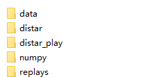
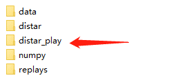
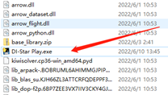
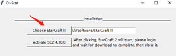
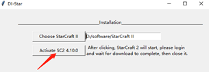
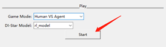

# 安装教程
1.下载DISTAR:

腾讯微云: 
https://share.weiyun.com/8hERro2k

或者谷歌：
https://drive.google.com/file/d/1re0eJNQxL6OjQZTIq7jeq-6DyIRUB020/view?usp=sharing

2.解压distar.zip:

 

3.打开distar_play/DI-Star Play.exe:
  
 

  
4.选择星际2启动路径:

 
5.激活4.10.0版本的星际2:

 

点击后会打开一个4.10.0版本的录像，星际2会自动下载4.10.0版本，等待下载完成进入录像观看界面的时候关掉星际2
 
6.可以开战啦:

有3种游戏模式，6个AI可供选择，选好后点击Start星际就会自动启动了。

 
 

## 小贴士:

1.1060以上的Nvidia卡才能保证AI的性能。

2.录像会保存在这个文件夹下：

 
3.快捷键:

先手动进入星际找到自己的快捷键文件夹Hotkeys，然后打开我的电脑的找到文档，在文档里面找到StarCraft II文件夹，把Hotkeys放在这个文件夹下，进入游戏后就可以选择自己的快捷键了。
 
 
